 Обеспечить доступ в сеть Интернет. Осуществить проверку этого доступа и приложить скриншот из терминала. 

# Лабораторная работа 3

Сделал: `Ахмедов Бахадыр`

## Часть 1

Проверяем есть ли доступ в сеть интернет 

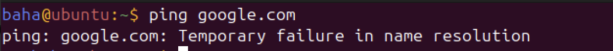

для того чтобы обеспечить доступ в сеть Интернет, заходим в  `Settings` `-->` `Network`, нажимаем на  `Add Ethernet Connection`

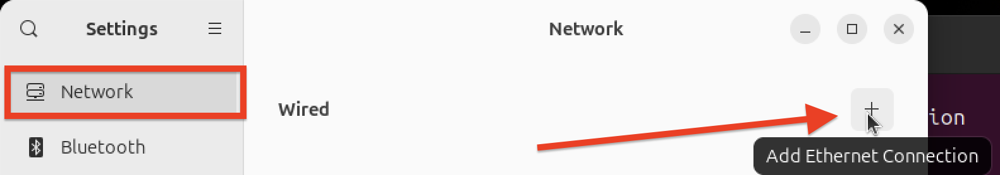

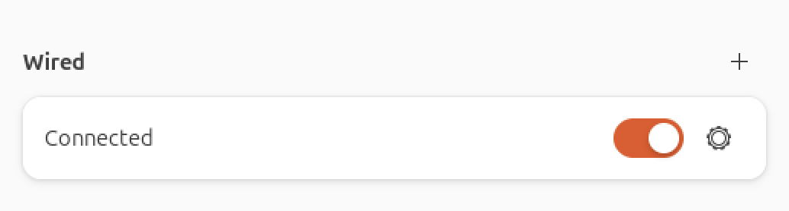

Затем проверяем 

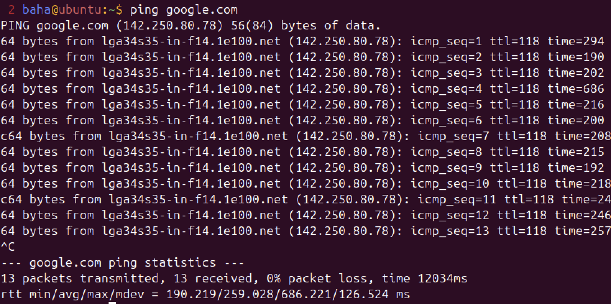

Доступ в сеть интернет обеспечен

## Часть 2

Для того чтобы обеспечить сетевой доступ от машины А к машину Б, в настройках машины `А`  переходм в `-->` `Network` затем меняем `Network Mode` на `Bridge(Advanced)`, проделываем также с машиной `Б`

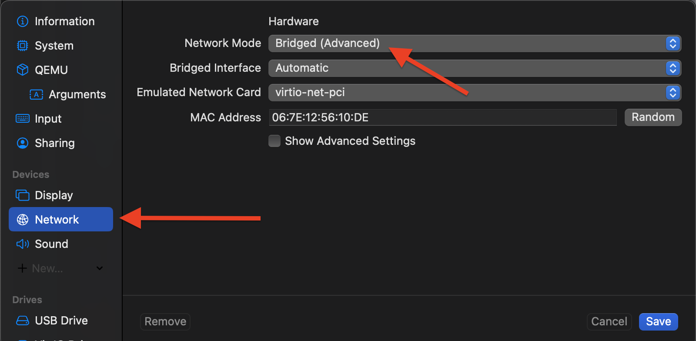

`ip` адрес машины `А`

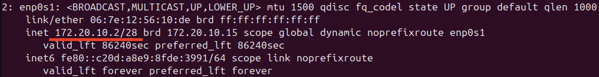

`ip` адрес машины `Б`

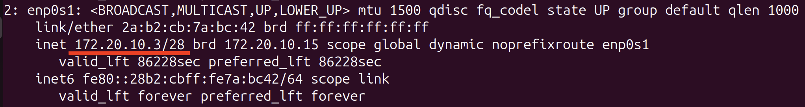

проверяем сетевой доступ из машины `А` в машину `Б`

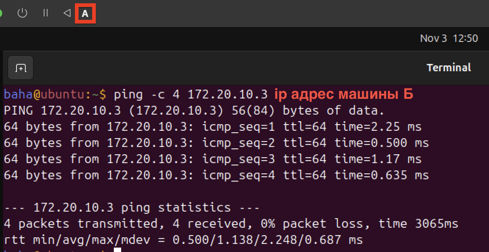

## Часть 3

`ip` адрес машины `В`

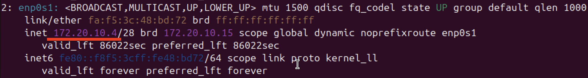

Проверяем сетевой доступ из машины `А` в 
машину `В`

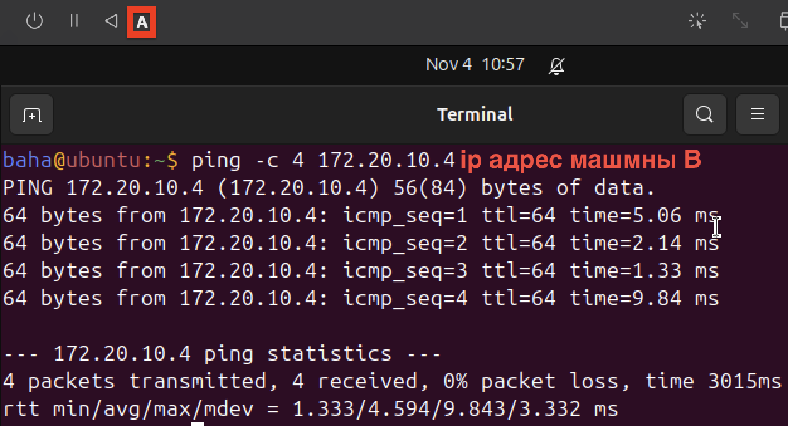

## Часть 4

Проверяем сетевой доступ из машины `Б` в `В`

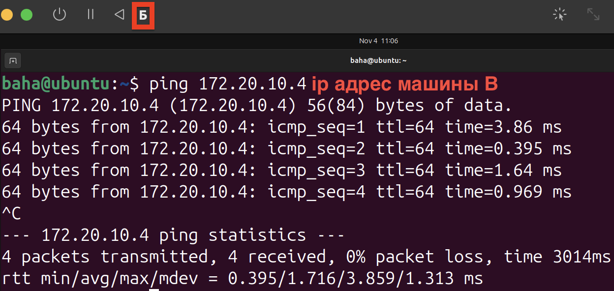

Запретим доступ из машины `Б` в машину `В`

Для запрета доступа используем команду 
`sudo iptables -A OUTPUT -d 172.20.10.4 -j DROP`, и проверяем 

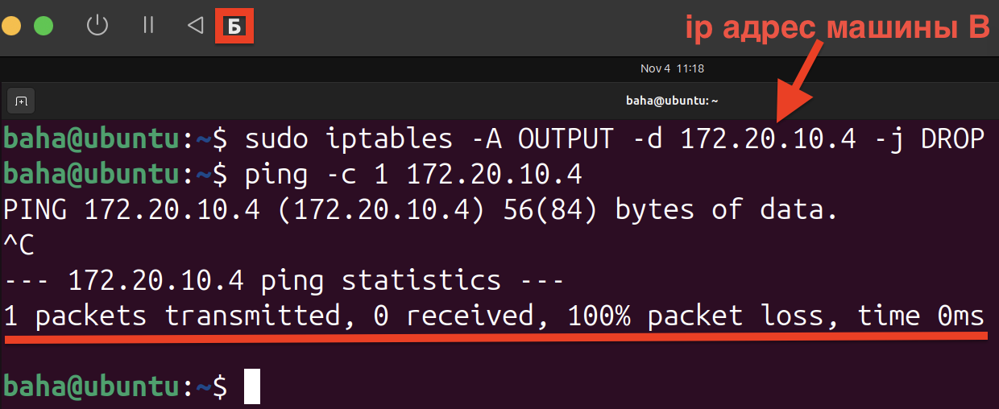

Видим что доступ запрещен

## Часть 5

Машина `А` соеденина с машиной `Б` и `В` 

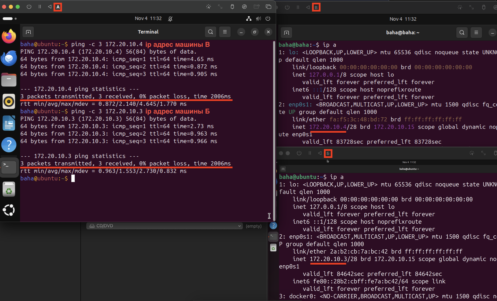

Машина `В` соеденина с машиной `А`, но не имеет доступ к машине `Б` 

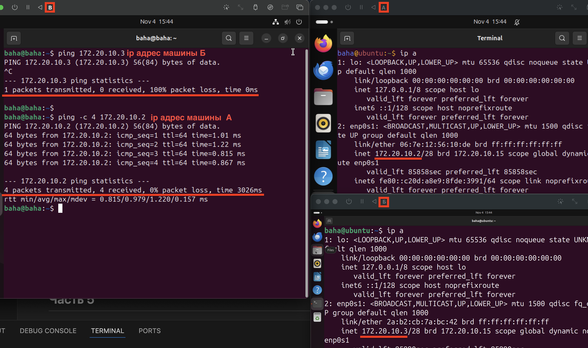

Машина `Б` соеденина с машиной `А`, но не имеет доступ к машине `В` 

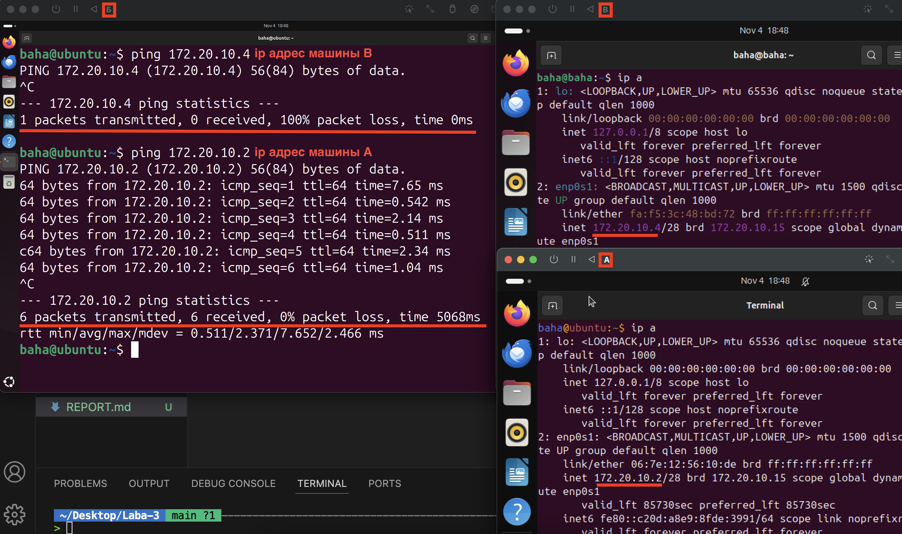

Все Виртуальные машины имеют доступ в интернет

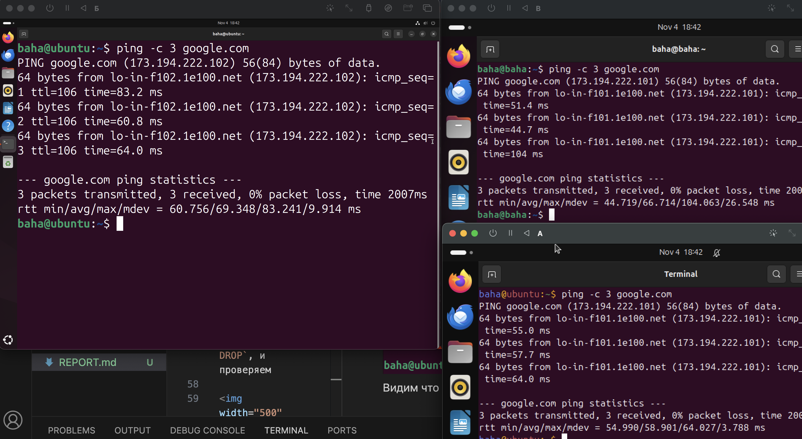
